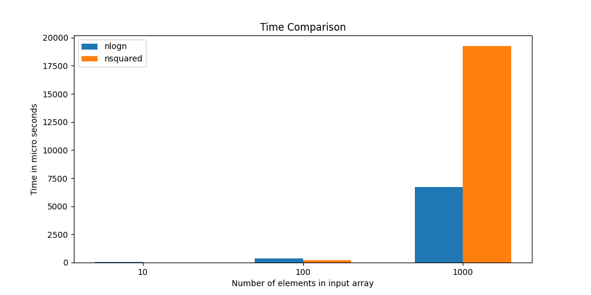

The **Fast Fourier Transform** is a method that allows computing the DFT in O(nlogn),using the special properties of n complex nth roots of unity.

We have implemented *Generic Fast Fourier Transform with application in Binary Strings’ Pattern Matching*.

We have created a namespace for Fast Fourier Transform(FFT).

**fft_build** is a function defined in the namespace. It is used to apply Fast Fourier Transform and Inverse Fourier Transform on the given vector. 

**init** is also a function defined in the namespace.It is used to copy the elements of the container to a vector(will be used later).

**multiply** is a function which is used to multiply two containers and performs the multiplication of the two vectors in O(nlogn) time.

**binary_matching** is a hamming distance calculator which is used for pattern matching to check if a binary string ‘pattern’ appears in a binary string ‘str’. It uses FFT to do the pattern matching.

**COMPARISON between FFT approach and polynomial approach**

* For 10,100,1000 elements 

* For 10000,50000,100000 elements 
